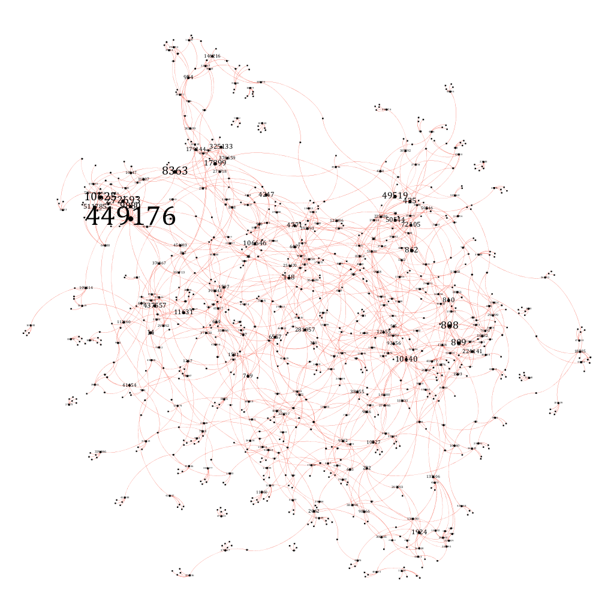

## Python Gephi Project

Python script to fetch movies and similar movies from moviedb and create graph structure using Gephi highlighting node significance. Basic http library used as a requirement.

Graph constructed with Gephi examining movie similarities 

